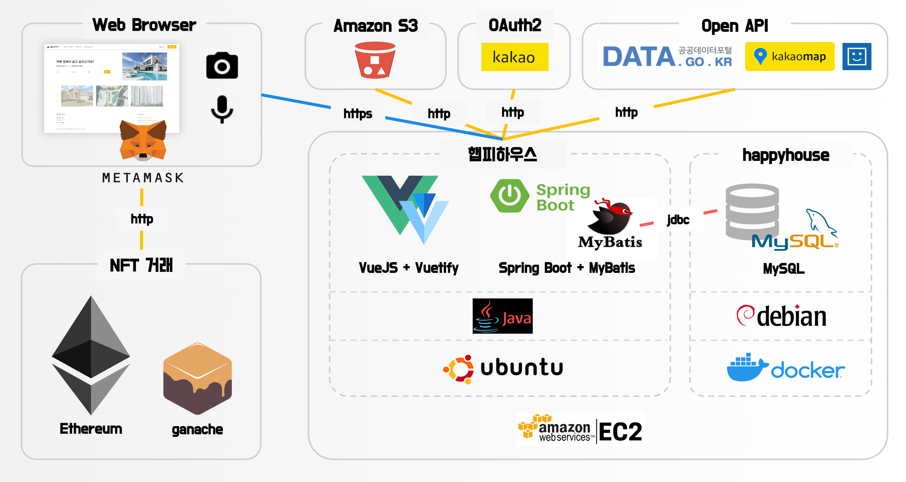

## (언)햅피하우스

 

 

### 🔥 프로젝트 소개

  

사용자가 주택 실거래가 정보를 한눈에 비교할 수 있도록 하는 서비스입니다.

데이터는 공공 데이터 포털에서 가져와, 가공 후 사용했습니다.

사용자는 지역별/아파트별 거래 정보를 보고, 원하는 매물을 찾을 수 있습니다.

 

### 🗂 프로젝트 구조

 

### 📝 프로젝트 기능

 

### 🎞 Demo 영상

 

### 팀 소개

| 이름 | 기능 | 개발 상세 내용 |
| :---: | :---: | --- |
| 강봉민 (Front-end & Back-end) | 회원 관리 |  - 일반 회원 가입 구현 - 회원 정보 수정, 탈퇴 구현 - 로그인, 로그아웃 구현 - 카카오 OAuth 로그인 구현 - JWT를 이용한 토큰 생성 및 로그인 관리 - 사용자 관심 매물 목록 관리 |
|  | 실거래가 조회 |  - 사용자 음성을 이용한 아파트 검색 구현 |
|  | 게시판 관리 |  - 게시글 작성 구현 - 게시글 수정, 삭제 구현 - 답글 기능 구현 - 게시글 조회 결과 제목으로 검색 |
| 조혜은 (Front-end & Back-end) | 표정 분석 |  - 웹캠 연결 후 촬영한 이미지 파일 생성 - Amazon S3 연동하여 이미지 파일 업로드 - Azure Face API 활용한 사용자 표정 분석 |
|  | 보안 |  - BCrypt를 이용한 비밀번호 암호화 - Lucy Filter를 이용한 Reflected XSS 방어 |
|  | 실거래가 조회 |  - 아파트 목록 렌더링 - 아파트 상세 정보 렌더링 - 아파트 단위로 검색 결과 렌더링 |
|  | 게시판 관리 |  - 게시글 목록 조회 - 게시글 조회 |

